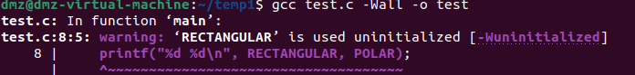
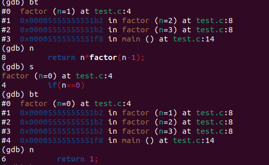

# Linux-C-note

# 前言

> 有些职业教育给出的答案是“实用主义”，打出了“有用就学，没有用就不学”的口号，大肆贬低说大学里教的基础课都是过时的、无用的，只有他们教的技术才是实用的，这种炒作很不好，我认为大学里教的每一门课都是非常有用的，基础知识在任何时候都不会过时，倒是那些时髦的“实用技术”有可能很快就过时了。

> K&R写得非常好，代码和语言都非常简洁，但很可惜，只有会C语言的人才懂得欣赏它，K&R是非常不适合入门学习的，尤其不适合零基础的学生入门学习。

为什么要在Linux平台上学习C语言而不是Windows上？

> 一、C语言是一种面向底层的编程语言，要写好C程序，必须对操作系统的工作原理非常清楚，因为操作系统也是用C写的，我们用C写应用程序直接使用操作系统提供的接口。Linux是一种开源的操作系统，你有任何疑问都可以从源代码和文档中找到答案。而Windows是一种封闭的操作系统，除了微软的员工别人都看不到它的源代码，只能通过文档去猜测它的工作原理，更糟糕的是，微软向来喜欢藏着揶着，好用的功能留着自己用，而不会写到文档里公开。
>
> 二、Windows平台上的开发工具往往和各种集成开发环境（IDE，Integrated Development Environment）绑在一起，例如Visual Studio、Eclipse等。使用IDE确实很便捷，但IDE对于初学者绝对不是好东西。

# 一、程序的基本概念

## 1.1 程序和编程语言

汇编语言，把机器语言中一组一组的数字用**助记符（Mnemonic）**表示，直接用这些助记符写出汇编程序，然后让**汇编器（Assembler）**去查表把助记符替换成数字，这个过程叫做**汇编**也就把汇编语言翻译成了机器语言。

汇编语言和机器语言的指令是一一对应的，C语言的语句和低级语言的指令之间不是简单的一一对应关系，一条`a=b+1;`语句要翻译成三条汇编或机器指令，这个过程称为**编译（Compile）**，由**编译器（Compiler）**来完成，显然编译器的功能比汇编器要复杂得多。

编译需要花一些时间，这是用高级语言编程的一个缺点，然而更多的是优点。首先，用C语言编程更容易，写出来的代码更紧凑，可读性更强，出了错也更容易改正。其次，C语言是**可移植的（Portable）**或者称为**平台无关的（Platform Independent）**。

平台这个词有很多种解释，可以指**计算机体系结构（Architecture）**，也可以指**操作系统（Operating System）**，也可以指开发平台（编译器、链接器等）。不同的计算机体系结构有不同的**指令集（Instruction Set）**，可以识别的机器指令格式是不同的，直接用某种体系结构的汇编或机器指令写出来的程序只能在这种体系结构的计算机上运行，然而各种体系结构的计算机都有各自的C编译器，可以把C程序编译成各种不同体系结构的机器指令，这意味着用C语言写的程序只需稍加修改甚至不修改就可以在各种不同计算机上编译运行。

还要注意一点，即使在相同的体系结构和操作系统下，用不同的C编译器（或者同一个C编译器的不同版本）编译同一个程序得到的结果也有可能不同，C语言有些语法特性在C标准中并没有明确规定，各编译器有不同的实现，编译出来的指令的行为特性也会不同，**应该尽量避免使用不可移植的语法特性。**

**编译与解释**

* 相同之处：都要变成二进制代码才能执行
* 不同之处：
  * **运行的时候是否需要编译器**：编译型语言运行的是最终的二进制代码了，所以不再需要编译器；但是解释型语言边解释、边运行，所以运行时候还有部分代码没有解释好举个例子：在浏览器里，要看 html 效果，要通过带有内置编译工具的软件去查看（如：浏览器或者模拟浏览器的工具）
  * **执行速度**：一般来说，边翻译边执行的解释型语言的速度会比编译型语言运行速度要慢
  * **可移植性对比**：编译型语言运行二进制内容，一旦 CPU 指令改变，之前的二进制文件可能运行不了了。即在其他硬件平台上运行，可能出错，如果想在其他平台运行就需要编译出新的二进制文件，所以编译型语言可移植性差；解释型语言在需要的时候才开始编译、运行，所以具有可移植性，在很多平台都能运行起来。
  * **升级上对比**：编译型语言的二进制文件如果要升级，需要重新下载一个新的二进制文件了。如QQ的升级，就是要重新下载、安装、覆盖；而解释型的语言，只要重新写好源代码即可。如网站平台升级，用户只要重新刷新即可。
  * **应用领域**：编译型语言应用领域通常是安装软件，如：桌面或手机上安装软件；解释型的语言的应用领域通常是互联网，网站等，刷新就可以看到最新效果。

## 1.2 自然语言与形式语言

自然语言就是人类讲的语言，比如汉语、英语和法语；形式语言是为了特定应用而人为设计的语言，例如数字和运算符号，编程语言也是一种形式语言。

形式语言有严格的**语法（Syntax）**规则，语法规则是由**符号（Token）**和**结构（Structure）**的规则所组成的，关于Token的规则称为**词法（Lexical）**规则，而关于结构的规则称为**语法（Grammar）**规则，如果对于某句话的分析结合了**上下文（Context）**，那么就属于了**语义（Semantic）**的范畴了。

> 很不幸，Syntax和Grammar通常都翻译成“语法”，这让初学者非常混乱，Syntax的含义其实包含了Lexical和Grammar的规则，还包含一部分语义的规则，例如在C程序中变量应先声明后使用。即使在英文的文献中Syntax和Grammar也常混用，在有些文献中Syntax的含义不包括Lexical规则，只要注意上下文就不会误解。

## 1.3 程序的调试

**程序的分类**

* 编译时错误：无法编译出可执行文件
* 运行时错误（Run-Time）：可以编译出可执行文件，但是当程序运行的时候就会发生崩溃
* 逻辑错误和语义错误：编译和运行都没问题，但是程序没有干该干的事情，而是干了别的事情

## 1.4 第一个程序

**警告和错误**

警告信息不是致命错误，编译仍然可以继续，如果整个编译过程只有警告信息而没有错误信息，仍然可以生成可执行文件。但是，警告信息也是不容忽视的。出警告信息说明你的程序写得不够规范，可能有Bug，虽然能编译生成可执行文件，但程序的运行结果往往是不正确的。一个好的习惯是打开`gcc`的`-Wall`选项，也就是让`gcc`提示所有的警告信息，不管是严重的还是不严重的，然后把这些问题从代码中全部消灭，如：

```
$ gcc -Wall main.c
main.c: In function ‘main’:
main.c:7: warning: null argument where non-null required (argument 1)
```

# 三、简单函数

## 3.1 数学函数

我们调用`printf`不是为了得到它的返回值，而是为了利用它所产生的**副作用（Side Effect）**，Side Effect这个概念也适用于运算符组成的表达式，比如`a + b`这个表达式也可以看成一个函数调用，把运算符`+`看作函数，它的两个参数是`a`和`b`，返回值是两个参数的和，传入两个参数，得到一个返回值，并没有产生任何Side Effect。而赋值运算符是有Side Effect的，如果把`a = b`这个表达式看成函数调用，返回值就是所赋的值，既是`b`的值也是`a`的值，但除此之外还产生了Side Effect，就是变量`a`被改变了，**改变计算机存储单元里的数据或者做输入输出操作都算Side Effect。**

使用`math.h`中声明的库函数还有一点特殊之处，`gcc`命令行必须加`-lm`选项，因为数学函数位于`libm.so`库文件中（这些库文件通常位于`/lib`目录下），`-lm`选项告诉编译器，我们程序中用到的数学函数要到这个库文件里找。本书用到的大部分库函数（例如`printf`）位于`libc.so`库文件中，使用`libc.so`中的库函数在编译时不需要加`-lc`选项，当然加了也不算错，因为这个选项是`gcc`的默认选项。

C标准主要由两部分组成，一部分描述C的语法，另一部分描述C标准库。在Linux平台上最广泛使用的C函数库是`glibc`，几乎所有C程序都要调用`glibc`的库函数，所以`glibc`是Linux平台C程序运行的基础。`glibc`提供一组头文件和一组库文件，最基本、最常用的C标准库函数和系统函数在`libc.so`库文件中，几乎所有C程序的运行都依赖于`libc.so`，有些做数学计算的C程序依赖于`libm.so`，以后我们还会看到多线程的C程序依赖于`libpthread.so`。`glibc`并不是Linux平台唯一的基础C函数库，也有人在开发别的C函数库，比如适用于嵌入式系统的`uClibc`。

# 七、结构体

## 7.1 复合类型和结构体

在编程语言中，最基本的、不可再分的数据类型称为**基本类型（Primitive Type）**，例如整型、浮点型；根据语法规则由基本类型组合而成的类型称为**复合类型（Compound Type）**。有些场合下要把复合类型当作一个整体来用，而另外一些场合下需要分解组成这个复合类型的各种基本类型，复合类型的这种两面性为**数据抽象（Data Abstraction）**奠定了基础。

结构体定义

```c
struct complex_struct {
    double x, y;
} z1, z2;
```

定义好之后，也可以去声明一些新的变量：

```c
struct complex_struct z3, z4;
```

也可以不写Tag，但这种情况下，不能再去声明新的变量，如：

```c
struct {
    double x, y;
} z1, z2;
```

结构体变量也可以在定义时初始化，例如：

```c
struct complex_struct z = { 3.0, 4.0 };
```

Initializer中的数据依次赋给结构体的各成员。如果Initializer中的数据比结构体的成员多，编译器会报错，但如果只是末尾多个逗号则不算错。如果Initializer中的数据比结构体的成员少，未指定的成员将用0来初始化，就像未初始化的全局变量一样。例如以下几种形式的初始化都是合法的：

```c
double x = 3.0;
struct complex_struct z1 = { x, 4.0, }; /* z1.x=3.0, z1.y=4.0 */
struct complex_struct z2 = { 3.0, }; /* z2.x=3.0, z2.y=0.0 */
struct complex_struct z3 = { 0 }; /* z3.x=0.0, z3.y=0.0 */
```

**Designated Initializer**是C99引入的新特性，用于初始化稀疏（Sparse）结构体和稀疏数组很方便。有些时候结构体或数组中只有某一个或某几个成员需要初始化，其它成员都用0初始化即可，用Designated Initializer语法可以针对每个成员做初始化（Memberwise Initialization），很方便。例如：

```c
struct complex_struct z1 = { .y = 4.0 }; /* z1.x=0.0, z1.y=4.0 */
```

严格来说，可以做算术运算的类型称为**算术类型（Arithmetic Type）**，算术类型包括整型和浮点型。可以表示零和非零，可以参与逻辑与、或、非运算或者做控制表达式的类型称为**标量类型（Scalar Type）**，标量类型包括算术类型和以后要讲的指针类型

## 7.2 枚举enum

```c
enum coordinate_type { RECTANGULAR, POLAR };
struct complex_struct {
    enum coordinate_type t;
    double a, b;
};
```

`enum`关键字的作用和`struct`关键字类似，把`coordinate_type`这个标识符定义为一个Tag，`struct complex_struct`表示一个结构体类型，而`enum coordinate_type`表示一个枚举（Enumeration）类型。枚举类型的成员是常量，它们的值由编译器自动分配，例如定义了上面的枚举类型之后，`RECTANGULAR`就表示常量0，`POLAR`表示常量1。如果不希望从0开始分配，可以这样定义：

```
enum coordinate_type { RECTANGULAR = 1, POLAR };
```

这样，`RECTANGULAR`就表示常量1，而`POLAR`表示常量2。枚举常量也是一种整型，其值在编译时确定，因此也可以出现在常量表达式中，可以用于初始化全局变量或者作为`case`分支的判断条件。

枚举的成员名却和变量名在同一命名空间中，所以会出现命名冲突。例如这样是不合法的：

```c
int main(void)
{
    enum coordinate_type { RECTANGULAR = 1, POLAR };
    int RECTANGULAR;
    printf("%d %d\n", RECTANGULAR, POLAR);
    return 0;
}
```

**习题：编译运行下面这段程序：**

```c
#include <stdio.h>
 
enum coordinate_type { RECTANGULAR = 1, POLAR };
 
int main(void)
{
    int RECTANGULAR;
    printf("%d %d\n", RECTANGULAR, POLAR);
    return 0;
}
```

结果：

# 九、编码风格

**indent工具**

```bash
$ indent -kr -i8 main.c 
$ cat main.c
```

`-kr`选项表示K&R风格，`-i8`表示缩进8个空格的长度。如果没有指定`-nut`选项，则每8个缩进空格会自动用一个Tab代替。

# 十、gdb

如果想要使用gdb对代码进行调试，需要加上编译选项`-g`，例如：

```bash
$ gcc -g main.c -o main
$ gdb main
```

gdb的命令汇总：

```bash
backtrace（或bt）	查看各级函数调用及参数
finish	连续运行到当前函数返回为止，然后停下来等待命令
frame（或f)+帧编号	选择栈帧
info（或i）+locals/变量名	查看当前栈帧局部变量/指定变量的值
list（或l）	列出源代码，接着上次的位置往下列，每次列10行
list+行号	列出从第几行开始的源代码
list+函数名	列出某个函数的源代码
next（或n）	执行下一行语句
print（或p）	打印表达式的值，通过表达式可以修改变量的值或者调用函数
quit（或q）	退出gdb调试环境
set+var+变量=值    	修改变量的值
start	开始执行程序，停在main函数第一行语句前面等待命令
step（或s）	执行下一行语句，如果有函数调用则进入到函数中
break（或b）+行号	在某一行设置断点
break+函数名	在某个函数开头设置断点
break … if …	设置条件断点（如break 9 if sum != 0）
continue（或c）	从当前位置开始连续运行程序
delete breakpoints+断点号	删除断点
display+变量名	跟踪查看某个变量，每次停下来都显示它的值
disable breakpoints+断点号	禁用断点
enable 断点号	启用断点
info（或i） breakpoints	查看当前设置了哪些断点
run（或r）	从头开始连续运行程序
undisplay+跟踪显示号	取消跟踪显示
watch	设置观察点
info（或i）+watchpoints	查看当前设置了哪些观察点
x	从某个位置开始打印存储单元的内容，全部当成字节来看，而不区分哪个字节属于哪个变量
```

**递归代码栈帧变化举例**

```c
#include <stdio.h>
int factor(int n)
{
  if(n==0)
  {
    return 1;
  }
  return n*factor(n-1);
}
int main()
{
  int n;
  scanf("%d",&n);
  printf("%d",factor(n));
  return 0;
}
```

部分结果如右图所示：


**段错误举例**

```c
#include <stdio.h>
 
int main(void)
{
    int sum = 0, i = 0;
    char input[5];
 
    scanf("%s", input);
    for (i = 0; input[i] != '\0'; i++) {
        if (input[i] < '0' || input[i] > '9') {
            printf("Invalid input!\n");
            sum = -1;
            break;
        }
        sum = sum*10 + input[i] - '0';
    }
    printf("input=%d\n", sum);
    return 0;
}
```

在输入一个很长很长的字符串之后，会发生段错误，用gdb运行会出现以下结果：

```bash
$ gdb main
...
(gdb) r
Starting program: /home/akaedu/main 
1234567890abcdef
Invalid input!
input=-1
 
Program received signal SIGSEGV, Segmentation fault.
0x0804848e in main () at main.c:19
19    }
(gdb) l
14            }
15            sum = sum*10 + input[i] - '0';
16        }
17        printf("input=%d\n", sum);
18        return 0;
19    }
```

`gdb`指出，段错误发生在第19行。可是这一行什么都没有啊，只有表示`main`函数结束的}括号。这可以算是一条规律，如果某个函数的局部变量发生访问越界，有可能并不立即产生段错误，而是在函数返回时产生段错误。

# 十五、数据类型详解

## 15.1 整型

**整数加减运算的三种表示方法**

* Sign and Magnitude表示法：把最高位规定为符号位（Sign Bit），0表示正1表示负，剩下的7位表示绝对值的大小，这样用8个bit表示整数的取值范围是-127~127
* 1’s Complement表示法：负数用1的补码也就是反码（1’s Complement）表示，减法转换成加法，计算结果的最高位如果有进位则要加回到最低位上去，如：00001000-00000100 → 00001000+(-00000100) → 00001000+11111011 → 00000011进1 → 高位进的1加到低位上去，结果为00000100。1’s Complement表示法相对于Sign and Magnitude表示法的优势是非常明显的：不需要把符号和绝对值分开考虑，正数和负数的加法都一样算，计算逻辑更简单，甚至连减法器电路都省了，只要有一套加法器电路，再有一套把每个bit取反的电路，就可以做加法和减法运算。如果8个bit采用1’s Complement表示法，负数的取值范围是从10000000到11111111（-127，0）正数是（0，127），仍然可以根据最高位判断一个数是正是负。美中不足的是0的表示仍然不唯一，既可以表示成11111111也可以表示成00000000，为了解决这最后一个问题，我们引入2’s Complement表示法。
* 2’s Complement表示法：正数不变，负数先取反码再加1。如果8个bit采用2’s Complement表示法，负数的取值范围是从10000000到11111111（-128，-1），正数是从00000000到01111111（0，127）。

C标准的原则之一是：优先考虑效率，而可移植性尚在其次，写不可移植的代码有时候也是必要的，比如Linux内核代码使用了很多只有`gcc`支持的语法特性以得到最佳的执行效率，在写这些代码的时候就没打算用别的编译器编译，也就没考虑可移植性的问题。如果要写不可移植的代码，你也必须清楚代码中的哪些部分是不可移植的，以及为什么要这样写，如果不是为了效率，一般来说就没有理由故意写不可移植的代码。

**Implementation-defined、Unspecified和Undefined**

* Implementation-defined：C标准不明确规定，但要求编译器必须对此进行规定，不带`signed`或`unsigned`关键字的`char`型是无符号数还是有符号数呢？C标准规定这是Implementation Defined
* Unspecified：C标准没有明确规定按哪种方式处理，编译器可以自己决定，并且也不必写在编译器的文档中，这样即便用同一个编译器的不同版本来编译也可能得到不同的结果，比如一个函数调用的各个实参表达式按什么顺序求值是Unspecified的。
* Undefined的情况则是完全不确定的，C标准没规定怎么处理，编译器很可能也没规定，甚至也没做出错处理，有很多Undefined的情况编译器是检查不出来的，最终会导致运行时错误，比如数组访问越界就是Undefined的。

还有一点要注意，除了`char`型以外的这些类型如果不明确写`signed`或`unsigned`关键字都表示`signed`，这一点是C标准明确规定的，不是Implementation Defined。除了`char`型在C标准中明确规定占一个字节之外，其它整型占几个字节都是Implementation Defined。通常的编译器实现遵守ILP32或LP64规范，如下表所示。

| 类型      | ILP32（位数） | LP64（位数） |
| :-------- | :------------ | :----------- |
| char      | 8             | 8            |
| short     | 16            | 16           |
| int       | 32            | 32           |
| long      | 32            | 64           |
| long long | 64            | 64           |
| 指针      | 32            | 64           |

ILP32这个缩写的意思是`int`（I）、`long`（L）和指针（P）类型都占32位，通常32位计算机的C编译器采用这种规范，x86平台的`gcc`也是如此。LP64是指`long`（L）和指针占64位，通常64位计算机的C编译器采用这种规范。x86/Linux/gcc，遵循ILP32。

对于整数常量，我们可以在最后添加后缀，具体对应关系如下：

| 后缀                 | 十进制常量                                            | 八进制或十六进制常量                                         |
| :------------------- | :---------------------------------------------------- | :----------------------------------------------------------- |
| 无                   | int long int long long int                            | int unsigned int long int unsigned long int long long int unsigned long long int |
| u或U                 | unsigned int unsigned long int unsigned long long int | unsigned int unsigned long int unsigned long long int        |
| l或L                 | long int long long int                                | long int unsigned long int long long int unsigned long long int |
| 既有u或U，又有l或L   | unsigned long int unsigned long long int              | unsigned long int unsigned long long int                     |
| ll或LL               | long long int                                         | long long int unsigned long long int                         |
| 既有u或U，又有ll或LL | unsigned long long int                                | unsigned long long int                                       |

给定一个整数常量，比如1234U，那么它应该属于“u或U”这一行的“十进制常量”这一列，这个表格单元中列了三种类型`unsigned int`、`unsigned long int`、`unsigned long long int`，从上到下找出第一个足够长的类型可以表示1234这个数，那么它就是这个整数常量的类型，如果`int`是32位的那么`unsigned int`就可以表示。

再比如0xffff0000，应该属于第一行“无”的第二列“八进制或十六进制常量”，这一列有六种类型`int`、`unsigned int`、`long int`、`unsigned long int`、`long long int`、`unsigned long long int`，第一个类型`int`表示不了0xffff0000这么大的数，我们写这个十六进制常量是要表示一个正数，而它的MSB（第31位）是1，如果按有符号`int`类型来解释就成了负数了，第二个类型`unsigned int`可以表示这个数，所以这个十六进制常量的类型应该算`unsigned int`。所以请注意，0x7fffffff和0xffff0000这两个常量虽然看起来差不多，但前者是`int`型，而后者是`unsigned int`型。

我们知道x86平台上`int`的取值范围是-2147483648~2147483647，那么用`printf("%d\n", -2147483648);`打印`int`类型的下界有没有问题呢？如果用`gcc main.c -std=c99`编译会有警告信息：`warning: format ‘%d’ expects type ‘int’, but argument 2 has type ‘long long int’`。这是因为，虽然-2147483648这个数值能够用`int`型表示，但在C语言中却没法写出对应这个数值的`int`型常量，C编译器会把它当成一个整数常量2147483648和一个负号运算符组成的表达式，而整数常量2147483648已经超过了`int`型的取值范围，在x86平台上`int`和`long`的取值范围相同，所以这个常量也超过了`long`型的取值范围，根据上表第一行“无”的第一列`十进制常量`，这个整数常量应该算`long long`型的，前面再加个负号组成的表达式仍然是`long long`型，而`printf`的`%d`转换说明要求后面的参数是`int`型，所以编译器报警告。之所以编译命令要加`-std=c99`选项是因为C99以前对于整数常量的类型规定和上表有一些出入，即使不加这个选项也会报警告，但警告信息不准确，读者可以试试。如果改成`printf("%d\n", -2147483647-1);`编译器就不会报警告了，-号运算符的两个操作数-2147483647和1都是`int`型，计算结果也应该是`int`型，并且它的值也没有超出`int`型的取值范围；或者改成`printf("%lld\n", -2147483648);`也可以，转换说明`%lld`告诉`printf`后面的参数是`long long`型。

`long long i = 1234567890 * 1234567890;`编译时会有警告信息：`warning: integer overflow in expression`。1234567890是`int`型，两个`int`型相乘的表达式仍然是`int`型，而乘积已经超过`int`型的取值范围了，因此提示计算结果溢出。改成`long long i = 1234567890LL * 1234567890就可以了。

有些编译器（比如`gcc`）也支持二进制的整数常量，以0b或0B开头，比如0b0001111，但二进制的整数常量从未进入C标准，只是某些编译器的扩展，所以不建议使用。

## 15.2 浮点数与类型转换

